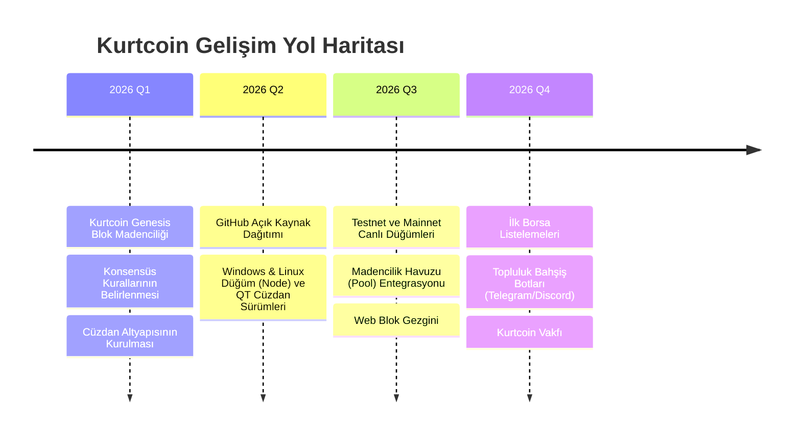

# 🐺 Kurtcoin (KURT): A Peer-to-Peer Electronic Wolfpack System
**Whitepaper v1.0 — 2026**

---

## 1. Abstract (Özet)
Kurtcoin (KURT), Bitcoin'in kanıtlanmış kriptografik güvenlik temelleri üzerine inşa edilmiş, topluluk odaklı, yüksek işlem hızlı ve merkeziyetsiz bir Katman-1 (Layer-1) blokzincir protokolüdür. 1 dakikalık blok onay süresi ve 100.000.000 adetlik optimize edilmiş toplam arzı ile mikro ödemeler, topluluk bahşişleri ve sınır ötesi dijital değer transferi için tasarlanmıştır.

---

## 2. Giriş ve Vizyon
Geleneksel finansal sistemler ve yüksek işlem ücretli birinci nesil blokzincirler, günlük mikro transferlerde kullanıcıları zorlamaktadır. Kurtcoin; şeffaflık, sadakat ve sürü bilinci (The Wolfpack) etrafında birleşen küresel bir topluluk oluşturmayı hedefler.

* **Merkeziyetsizlik:** Tek bir otorite veya şirket kontrolünde değildir.
* **Topluluk Gücü:** Madenciler ve doğrulayıcılar tarafından güvenceye alınır.
* **Hızlı Kesinlik:** Geleneksel Bitcoin'e göre 10 kat daha hızlı blok onayı sunar.

---

## 3. Temel Teknik Parametreler

| Parametre | Değer | Açıklama |
| :--- | :--- | :--- |
| **Proje Adı** | Kurtcoin | |
| **Birim Sembolü** | `KURT` | |
| **Maksimum Arz** | `100,000,000 KURT` | Enflasyonsuz, sabit nihai arz |
| **Blok Süresi** | `60 Saniye (1 Dakika)` | Hızlı P2P transferler |
| **Genesis Blok Ödülü** | `50 KURT` | Kurucu blok ödülü |
| **Halving (Yarılanma)** | Her `210,000` Blokta bir | Madencilik ödül yarılanması |
| **Konsensüs Algoritması**| Proof-of-Work (PoW) | SHA-256 Kriptografik Doğrulama |
| **P2P Ağ Portu** | `9333` | Bağımsız ağ portu |
| **Ağ Sihirli Baytları (Magic Bytes)** | `0x4B 0x55 0x52 0x54 ('KURT')` | Benzersiz ağ kimliği |

---

## 4. Genesis (Sıfırıncı) Blok

Kurtcoin'in ilk bloğu, bağımsızlığın ve topluluğun manifestosu olarak aşağıdaki değişmez verilerle blokzincire işlenmiştir:

* **Genesis Mesajı:**  
  `"Kurtcoin 2026: The Wolfpack Awakens - Loyalty, Freedom and Decentralization"`
* **Genesis Blok Hash'i:**  
  `00000ad4b509810ffa3bb36aa5071e885a34ca424d94820b44bb0c3d589364dc`
* **Genesis Merkle Root:**  
  `9ad9c01475d6c503610d705000accad383aebb190ce499f5b76fbfa605ed60dc`
* **Kurucu Rezerv / Ödül Adresi:**  
  `14FTsfBTzSBP9Zm9W65W1YNUEYhXJ3t6PA`

---

## 5. Yol Haritası (Roadmap)

---

## 6. Güvenlik ve Lisans
Kurtcoin tamamen açık kaynaklı olup **MIT Lisansı** altında korunmaktadır. Kodlar bağımsız denetime ve herkesin katkısına açıktır.
